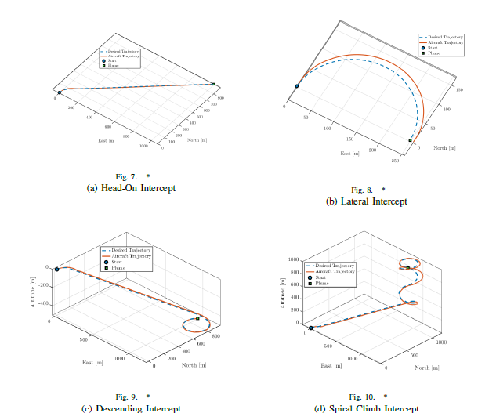
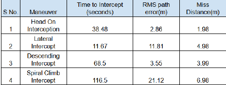
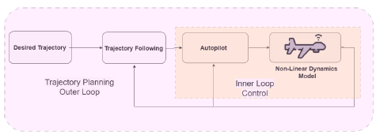
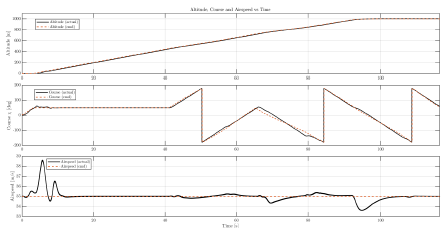
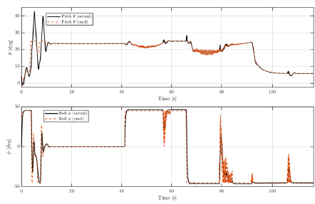

# Real-Time Trajectory Planning for Volcanic Plume Interception

**MSc Aerial Robotics Dissertation · University of Bristol & University of the West of England (2025)**
**Author:** Aliasgar Malik

A MATLAB framework that plans and flies dynamically feasible trajectories for a fixed-wing UAV to intercept a volcanic plume. It combines a **trajectory planner** that works in two phases (heading, then altitude), **waypoint guidance** that switches segments with a half-plane test, and a **cascaded PID autopilot**. These run in closed loop around a **nonlinear 6-DOF flight dynamics model** of the Aerosonde UAV, integrated with RK4.

<p align="center">
  
</p>

<p align="center">
  
</p>

---

## Motivation

Fixed-wing UAVs are used to fly into volcanic plumes and sample them (for example at Volcán de Fuego, Guatemala). The straight line to a plume is usually not flyable, because a fixed-wing aircraft has a minimum turn radius, a maximum bank angle, and pitch and climb-rate limits. This project generates paths that stay within those limits, so the aircraft can follow them and reach the plume reliably.

## Framework

<p align="center">
  
</p>

| Layer | What it does | Key files |
|---|---|---|
| **Trajectory generation** | Phase 1 turns toward the plume's azimuth using a rate-limited yaw (bounded by the minimum turn radius `R_min = V²/(g·tan φ_max)`). Phase 2 drives the altitude error to zero with a saturated proportional climb rate, which becomes a pitch command `θ_d = asin(ż_d / V)`. The output is a list of NED waypoints. | `trajectory_generation3.m` |
| **Trajectory following** | Follows the straight segments between waypoints. It moves to the next segment when the aircraft enters the half-plane `(p − wᵢ)ᵀnᵢ ≥ 0`, then turns the reference into course, altitude and airspeed commands. | `followWpp.m`, `pathFollowingCourseAltitudeAirspeed.m` |
| **Autopilot (longitudinal)** | Altitude → pitch (PI), pitch → elevator (PD), airspeed → throttle (PI) | `altitude_from_pitch_controller.m`, `pitch_attitude_controller.m`, `Airspeed_with_throttle_controller.m` |
| **Autopilot (lateral)** | Course → roll (PI), roll → aileron (PD) | `course_hold_controller.m`, `roll_hold.m` |
| **Flight dynamics** | 12-state nonlinear 6-DOF rigid-body model `[pn, pe, pd, u, v, w, φ, θ, ψ, p, q, r]`, with aerodynamic and propulsion forces and moments | `mav_6dof.m`, `forces_moments.m`, `Euler_rates.m` |
| **Trim** | Finds wings-level trim at `Va = 35 m/s` by nonlinear least squares (`lsqnonlin`) | `trim_init.m`, `call_lsq.m`, `trim_cost.m` |

---

## Repository structure

```
├── trajectory_generation3.m              # STEP 1 – generates the feasible path → traj.mat
├── Guidance_initialisation.m             # STEP 2 – closed-loop 6-DOF simulation + plots
├── dissertation_plots2.m                 # (optional) same simulation, publication-style figures + RMS error
│
├── param_1a.m                            # Aerosonde airframe, aero & propulsion parameters; runs trim
├── Params_autopilot.m                    # Autopilot limits & performance constraints (φ_max, θ_max, …)
├── trim_init.m, call_lsq.m, trim_cost.m  # Trim computation
│
├── mav_6dof.m                            # Nonlinear 6-DOF equations of motion
├── forces_moments.m                      # Aerodynamic, gravity & thrust forces/moments
├── Euler_rates.m, rotateBtoV.m, rotate_VtoB.m
│
├── followWpp.m                           # Waypoint following (half-plane switching)
├── pathFollowingCourseAltitudeAirspeed.m # (r, q) → χ_c, h_c, V_c commands
│
├── altitude_from_pitch_controller.m      # Autopilot loops
├── pitch_attitude_controller.m
├── course_hold_controller.m
├── roll_hold.m
├── Airspeed_with_throttle_controller.m
├── sat.m, wrapToPi.m                     # Utilities
│
├── images/                               # Figures used in this README
└── docs/Dissertation_Aliasgar_Malik.pdf  # Full dissertation
```

> All `.m` files call each other by name, so keep them in the **same folder** (or add the folder to the MATLAB path).

---

## Requirements

- **MATLAB** R2020a or newer (`dissertation_plots2.m` uses `exportgraphics`)
- **Optimization Toolbox**, needed by `lsqnonlin` in the trim routine

Simulink is **not** needed. The simulation is fully script-based and uses a fixed-step RK4 integrator with `dt = 0.01 s`.

> `wrapToPi.m` is included, so the Mapping Toolbox is not required.

---

## Running the simulation

**1. Set the plume location** in `trajectory_generation3.m`:

```matlab
% Plume position (NED: x = North, y = East, z = Down → negative z is ABOVE the start point)
xp = 900; yp = 1000; zp = -1000;   % e.g. spiral climb to 1000 m altitude
```

**2. Generate the trajectory:**

```matlab
>> trajectory_generation3
```
This computes trim, runs the two-phase planner, plots the planned 3-D path, and saves the waypoints to `traj.mat`.

**3. Fly the trajectory with the 6-DOF model and autopilot:**

```matlab
>> Guidance_initialisation
```
The aircraft starts in trimmed, wings-level flight at 35 m/s and tracks the waypoints until it is within the interception threshold of the plume. The script prints the time to intercept and plots:
- all 12 states against time
- the control inputs (δe, δa, δr, δt)
- the desired and flown 3-D trajectory

For figures formatted like those in the dissertation, plus RMS and peak path error, run `dissertation_plots2` instead of step 3. It exports `scenario_traj.pdf`, `scenario_error.pdf`, `states_grid.pdf` and `controls_grid.pdf`.

---

## Test scenarios & results

Four scenarios of increasing difficulty were simulated. Each one changes only the plume position `(xp, yp, zp)`.

| # | Scenario | Description | Time to intercept (s) | RMS path error (m) | Miss distance (m) |
|---|---|---|---|---|---|
| 1 | **Head-On** | Plume directly ahead at constant altitude (baseline) | 38.48 | 2.86 | 1.98 |
| 2 | **Lateral** | Plume to the side, past the minimum turn radius, so a coordinated turn is needed | 11.67 | 11.81 | 4.98 |
| 3 | **Descending** | Plume well below the aircraft, so a controlled descent is needed | 68.5 | 3.55 | 3.99 |
| 4 | **Spiral Climb** | Plume far above the aircraft, so it climbs in a helix within pitch and turn limits | 116.5 | 21.12 | 6.98 |

In every scenario the plume was intercepted within the **10 m** 3-D tolerance.

### Autopilot response: spiral climb (Scenario 4)

<p align="center">
  <br>
  <em>Commanded vs. actual altitude, course and airspeed</em>
</p>

<p align="center">
  <br>
  <em>Commanded vs. actual pitch (θ) and roll (φ)</em>
</p>

---

## Assumptions & limitations

- The plume is treated as a **stationary** target, with no wind or atmospheric disturbance.
- Full-state feedback is **ideal**, with no sensor noise or state estimator.
- The planner aims for **feasibility**, not minimum time or minimum energy.
- All results come from simulation. Hardware-in-the-loop testing and flight tests are future work.

## Future work

- Dynamic plume models that drift with the wind, and wind disturbances on the aircraft
- Realistic sensor models and state estimation
- Optimising planned trajectories for time or energy
- Hardware-in-the-loop and field validation

---

## References

Key references (the full list is in the [dissertation](docs/Dissertation_Aliasgar_Malik.pdf)):

1. R. W. Beard and T. W. McLain, *Small Unmanned Aircraft: Theory and Practice*, Princeton University Press, 2012. (Source of the Aerosonde model and the successive loop closure autopilot design.)
2. B. Schellenberg, T. S. Richardson, A. Richards, and M. Watson, "Automated real-time volcanic plume interception for UAVs," *AIAA SciTech Forum*, 2021.
3. B. Schellenberg et al., "On-board real-time trajectory planning for fixed wing unmanned aerial vehicles in extreme environments," *Sensors*, 19(19), 2019.

## Citation

```bibtex
@mastersthesis{malik2025plume,
  author = {Malik, Aliasgar},
  title  = {Real-Time Trajectory Planning for Volcanic Plume Interception},
  school = {University of Bristol and University of the West of England},
  type   = {MSc Aerial Robotics Dissertation},
  year   = {2025}
}
```
